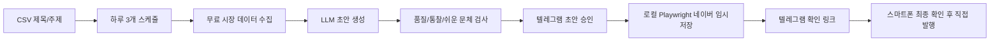

# 운영 서버 방식 결정

작성일: 2026-06-05

## 결론

현재 단계의 운영 방식은 **로컬 Mac LaunchAgent + 텔레그램 승인 + 네이버 임시저장 확인 링크**로 결정한다.

이유는 단순하다. 네이버 블로그 글쓰기 API 경로는 안정적인 선택지가 아니고, SmartEditor ONE은 로그인 세션과 실제 브라우저 상태의 영향을 크게 받는다. 월 3달러 이하 예산에서 24시간 운영을 목표로 하더라도, 네이버 임시저장 단계만큼은 로컬 브라우저 세션을 유지하는 방식이 가장 성공률이 높다.

## 운영 구조

## 하루 3개 슬롯

- 평일 국장 개장 전: 08:10 KST, `market_slot:kr_preopen`
- 평일 미장 개장 전: 미국 개장 60분 전 KST, `market_slot:us_preopen`
- 매일 통찰형 글: 18:30 KST, `market_slot:evergreen_insight`
- 주말/휴장일: 시장 브리핑 슬롯을 통찰형/회고형 글로 대체한다.

## 모델 운영 결정

- 기본 품질 모델: Qwen Plus
- 보조/파서/폴백: Groq Llama 계열
- DeepSeek: 키가 정상화되면 후보로 복귀 가능하지만, 현재 기본 경로에서는 제외한다.
- NVIDIA: 무료 키는 장점이 있지만 이번 한국어 시장 글 품질 테스트 기준으로는 기본 발행 후보에서 제외한다.
- 완전 자동 발행: 시장 브리핑 품질이 더 안정될 때까지 비활성화한다.

## 무료 데이터 수집 원칙

- 가격/지수: Stooq
- 금리/달러/매크로: FRED, 공개 데이터 캐시
- 코인 위험 선호 proxy: CoinGecko, Binance
- 글로벌 뉴스/섹터 이슈: GDELT, RSS
- 네이버 검색/뉴스/블로그: Naver Open API 또는 MCP/CLI 보조 도구

데이터가 충분하면 수치 기반 브리핑을 작성한다. 데이터가 부족하면 숫자 단정을 줄이고, 조건형 브리핑이나 통찰형 글로 자동 전환한다.

## GitHub/MCP 조사 반영

공개 GitHub 사례들은 네이버 블로그 업로드를 대부분 Selenium/Playwright 같은 브라우저 자동화로 처리한다. MCP/CLI는 업로드보다는 검색, 뉴스, 이미지, 네이버 데이터랩 같은 자료 수집에 적합하다.

적용 판단:

- `py-mcp-naver`, `naver-search-mcp`, `naver-cli`: 자료 수집 보조 후보
- `naver-finance-crawl-mcp`: 국내 금융 보조 데이터 후보
- Selenium 기반 네이버 블로그 자동화 예시: 셀렉터 변동, iframe, 캡차, 세션 유지 리스크 확인용 참고
- `scrapy-playwright`: 대량 크롤링 구조가 필요해질 때 검토, 현재 경량 목표에는 보류
- 범용 MCP CLI: 원격 MCP를 쓰고 싶을 때 검토, 현재는 코드 내 수집기가 더 가볍다.

## 무료 서버 후보 판단

### 로컬 Mac LaunchAgent

1차 운영 방식이다. 로그인 세션 유지, 캡차 대응, 실제 브라우저 확인, 네이버 임시저장 성공률에서 가장 유리하다. 전기/네트워크만 안정적이면 월 추가 비용도 사실상 없다.

### Cloudflare Workers

API 웹훅, 상태 확인, 가벼운 알림 라우팅에는 좋다. 그러나 네이버 브라우저 자동화 실행 환경으로는 부적합하다. 향후 텔레그램 webhook이나 운영 모니터링을 외부화할 때 사용한다.

### GitHub Actions

스케줄 실행, 테스트, 백업 점검, CSV 검증에는 좋다. 하지만 네이버 로그인 세션을 장기간 유지하는 브라우저 자동화에는 맞지 않는다.

### Google Colab 또는 무료 노트북

24시간 안정 운영 목적에는 맞지 않는다. 실험용으로만 본다.

### 월 3달러 이하 VPS

가능성은 있지만 GUI/브라우저/로그인 세션/캡차 리스크가 있어 첫 운영 방식으로 추천하지 않는다. 로컬 1주일 안정화 이후에도 필요할 때만 검토한다.

## 운영 성공 기준

- 하루 3개 job이 자동 생성된다.
- 평일에는 국장/미장/통찰형 구성이 유지된다.
- 주말과 휴장일에는 시장 브리핑이 통찰형 글로 대체된다.
- 텔레그램 초안에서 `승인` 또는 `수정본입력` 흐름이 정상 동작한다.
- 네이버 임시저장 후 텔레그램 확인 링크가 전송된다.
- 확인 링크에서 스마트폰으로 최종 점검 후 직접 발행할 수 있다.
- 시장 브리핑 샘플 10개 중 외국어 혼입, 근거 없는 정책 단정, 제목-본문 불일치가 0건이어야 완전 자동 발행을 다시 검토한다.

## 다음 운영 권장

로컬 LaunchAgent로 1주일 동안 draft-only 모드로 운용한다. 그 기간에는 매일 3개 중 시장 브리핑 2개를 실제로 읽어보고, 수정본입력으로 보정한 문장을 품질 규칙에 다시 반영한다. 품질 데이터가 쌓인 뒤에만 자동 발행 범위를 넓힌다.
