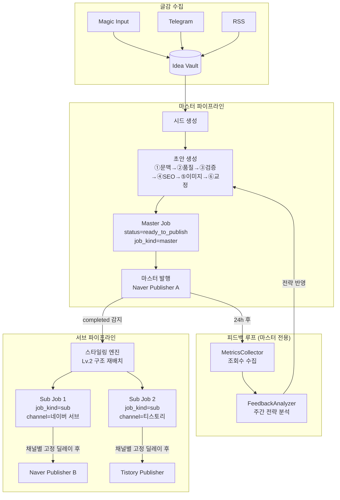

# 멀티채널 블로그 확장 청사진 v3.1 (코덱스 2차 검토 반영 확정판)

> **목적:** 마스터 콘텐츠 1건을 생성 → 등록된 각 채널에 Lv.2 스타일링 → 시차 발행하는 OSMU 시스템.
> **핵심 전제:** 노트북은 24시간 켜져 있지 않다. "프로그램이 켜진 시점"에 모든 밀린 작업을 보정(On-Wake).
> **기능 플래그:** `system_settings.multichannel_enabled` = true일 때만 서브 잡 생성/발행 활성.

---

## 1. 시스템 아키텍처



---

## 2. On-Wake 스케줄링 전략

### 2-1. 설계 원칙

- 크론(고정 시각)은 **보험용으로만 유지**.
- 핵심 동작은 `_run_startup_catchup()`에서 **"오늘/이번 주 했는가?" 플래그 기반** 판단.
- 실행 주체는 **worker(`run_scheduler.py`)만**. API 서버는 `api_only_mode=True`이므로 catch-up 미실행.

### 2-2. 프로그램 시작 시 실행 순서 (확장)

```python
async def _run_startup_catchup(self):
    # 1. 일간 시드 생성 (scheduler_last_seed_date != 오늘이면 즉시)
    await self._run_daily_quota_seed()
    # 2. 초안 생성 (ready 버퍼 부족하면 즉시)
    await self._run_draft_prefetch()
    # 3. 발행 슬롯 재배치 (켜진 시점~22시 남은 시간 균등 분배)
    await self._run_daily_target_check()
    # 4. 조회수 수집 (scheduler_last_metrics_date != 오늘이면 즉시)
    await self._run_metrics_collection()
    # 5. 주간 경쟁 갱신 (이번 주 안 했으면 즉시)
    await self._run_weekly_model_competition()
    # 6. 피드백 분석 (scheduler_last_feedback_week != 이번 주이면 즉시)
    await self._run_feedback_analysis()
    # 7. 서브 잡 배포 (미배포 마스터 completed가 있으면 즉시 스타일링+예약)
    #    multichannel_enabled 체크 포함
    await self._run_sub_job_catchup()
    # 8. 서브 잡 발행 (scheduled_at 지난 서브 잡이 있으면 즉시 발행)
    await self._run_sub_job_publish_catchup()
```

### 2-3. 발행 슬롯 — 꺼짐 보정

기본 앵커: 9시(출근), 12시(점심), 19시(퇴근)

| 시나리오 | 동작 |
|---------|------|
| 08시 정상 시작 | 앵커 그대로 |
| 14시 시작, 0/3 발행 | 14:30, 17:00, 19:30 재분배 |
| 14시 시작, 1/3 발행 | 15:30, 19:00 재분배 |
| 21시 시작, 0/3 발행 | 남은 시간 부족, 최대 1회만 |

**구현:** `_ensure_daily_publish_slots()` 수정 — `now_local` ~ `ACTIVE_HOURS[1]` 사이에 미소화 잔여 슬롯만 균등 분배.

### 2-4. DB 플래그 (KST 공용 함수 기반)

```python
def _today_key(self) -> str:
    return self._get_now_local().strftime("%Y-%m-%d")

def _week_key(self) -> str:
    d = self._get_now_local()
    return (d - timedelta(days=d.weekday())).strftime("%Y-W%W")
```

| 설정 키 | 용도 | 비교 함수 |
|---------|------|----------|
| `scheduler_last_seed_date` | 일간 시드 중복 방지 | ✅ 기존 |
| `scheduler_last_metrics_date` | 조회수 수집 중복 방지 | 🆕 `_today_key()` |
| `scheduler_last_feedback_week` | 주간 피드백 중복 방지 | 🆕 `_week_key()` |

> 서브 잡 배포 중복 방지는 `UNIQUE(master_job_id, channel_id)` DB 제약으로 보장. 날짜 플래그 불필요.

---

## 3. DB 스키마 설계

### 3-1. `channels` 테이블 (신규)

```sql
CREATE TABLE IF NOT EXISTS channels (
    channel_id           TEXT PRIMARY KEY,           -- UUID
    platform             TEXT NOT NULL,              -- 'naver' | 'tistory' | 'wordpress'
    label                TEXT NOT NULL,              -- 사용자 표시 이름
    blog_url             TEXT NOT NULL DEFAULT '',   -- blog.naver.com/my_id
    persona_id           TEXT NOT NULL DEFAULT '',   -- 할당된 페르소나
    persona_desc         TEXT DEFAULT '',            -- 페르소나 톤 힌트
    daily_target         INTEGER DEFAULT 0,          -- Phase 3용 (현재 0 고정)
    style_level          INTEGER DEFAULT 2,          -- 1=말투만, 2=구조재배치
    style_model          TEXT DEFAULT '',            -- 빈값=voice_step fallback
    publish_delay_minutes INTEGER DEFAULT 90,        -- 마스터 완료 후 고정 대기 시간
    is_master            INTEGER DEFAULT 0,          -- 1=마스터 (시스템 내 정확히 1개만)
    auth_json            TEXT DEFAULT '{}',          -- Phase 1: 평문, Phase 2: Fernet 암호화
    active               INTEGER DEFAULT 1,
    created_at           TEXT,
    updated_at           TEXT
);

-- is_master=1은 최대 1개
CREATE UNIQUE INDEX IF NOT EXISTS idx_channels_master
    ON channels(is_master) WHERE is_master = 1;
```

**`auth_json` 스키마 (플랫폼별):**

| 플랫폼 | 스키마 |
|--------|--------|
| naver | `{"session_dir": "data/sessions/naver_sub1"}` |
| tistory | `{"access_token": "...", "refresh_token": "...", "blog_name": "..."}` |
| wordpress | `{"site_url": "...", "username": "...", "app_password": "..."}` |

**암호화 로드맵:**

- Phase 1: 평문 + API 응답 마스킹 (`"***"`)
- Phase 2: Fernet 암호화 (키: `.env`의 `CHANNEL_ENCRYPTION_KEY`). 티스토리 access_token 보호 필수.

### 3-2. `jobs` 테이블 확장

```sql
ALTER TABLE jobs ADD COLUMN job_kind TEXT DEFAULT 'master';
-- 'master' | 'sub'

ALTER TABLE jobs ADD COLUMN master_job_id TEXT DEFAULT NULL;
-- NULL → 마스터 Job, 값 있음 → 서브 Job (FK → jobs.job_id)

ALTER TABLE jobs ADD COLUMN channel_id TEXT DEFAULT NULL;
-- 이 Job이 발행될 채널 (FK → channels.channel_id)

-- 서브 잡 중복 생성 DB 레벨 차단
CREATE UNIQUE INDEX IF NOT EXISTS idx_jobs_master_channel
    ON jobs(master_job_id, channel_id) WHERE master_job_id IS NOT NULL;

-- 피드백 루프 조인용 인덱스
CREATE INDEX IF NOT EXISTS idx_jobs_channel
    ON jobs(channel_id);
```

**레거시 데이터 마이그레이션:**

```sql
-- 기존 데이터: job_kind='master' (기본값으로 자동 처리)
-- channel_id 백필: 마스터 채널이 등록된 후 실행
UPDATE jobs SET channel_id = (
    SELECT channel_id FROM channels WHERE is_master = 1 LIMIT 1
) WHERE channel_id IS NULL AND status = 'completed';
```

> 마스터 채널 미등록 상태의 레거시 호환을 위해 피드백 루프 쿼리는 반드시
> `WHERE (j.channel_id IS NULL OR j.channel_id = :master_channel_id)` 조건 사용.

### 3-3. Job 상태 모델 (기존 status + cancelled 1종 추가)

```python
# job_store.py에 추가
STATUS_CANCELLED = "cancelled"   # 채널 비활성화 등 사용자 의도에 의한 취소
```

| status | 의미 | 비고 |
|--------|------|------|
| `queued` | 생성/스타일링 대기 | 마스터+서브 공용 |
| `running` | 파이프라인 실행 중 | |
| `retry_wait` | 재시도 대기 | |
| `generated` | 생성 완료, 평가 전 | |
| `evaluating` | 품질 평가 중 | |
| `failed_quality` | 품질 미달 | |
| `ready_to_publish` | 발행 대기 | |
| `completed` | 발행 완료 | |
| `failed` | 에러로 실패 | |
| **`cancelled`** | **사용자 의도에 의한 취소** | 🆕 채널 비활성화 등 |

> **설계 근거:** `failed`는 "파이프라인 에러"를 의미하므로 대시보드 실패율 통계에 포함됨.
> `cancelled`는 "정상적인 운영 취소"이므로 실패율에 포함하면 안 됨. 따라서 분리 필수.

---

## 4. API 설계

### 4-1. Channel CRUD — `server/routers/channels.py` (신규)

| Method | Endpoint | 설명 | 비고 |
|--------|----------|------|------|
| `GET` | `/api/channels` | 채널 목록 | auth_json은 `"***"` 마스킹 |
| `POST` | `/api/channels` | 채널 추가 | is_master=1 중복 시 에러 |
| `PUT` | `/api/channels/{id}` | 채널 수정 | |
| `DELETE` | `/api/channels/{id}` | 채널 삭제 | is_master=1 삭제 불가, soft delete(active=0), queued 서브 잡 → `cancelled` |
| `POST` | `/api/channels/{id}/test` | 연동 테스트 | 동기 10초 타임아웃 |

### 4-2. Sub Job 배포 — distribute API

```
POST /api/jobs/{job_id}/distribute
```

**동작:** 미생성 채널만 **부분 생성**. 이미 존재하는 채널은 건너뜀 (`INSERT OR IGNORE`).

**응답 스키마:**

```json
{
    "master_job_id": "abc-123",
    "created": 1,
    "skipped": 2,
    "failed": 0,
    "details": [
        {"channel_id": "ch-1", "channel_label": "네이버 서브", "action": "created", "sub_job_id": "sub-456"},
        {"channel_id": "ch-2", "channel_label": "티스토리", "action": "skipped", "reason": "already_exists"},
        {"channel_id": "ch-3", "channel_label": "워드프레스", "action": "skipped", "reason": "publisher_not_implemented"}
    ]
}
```

> 새 채널이 나중에 추가된 경우, 기존 마스터에 대해 다시 distribute를 호출하면 해당 채널에 대해서만 서브 잡이 생성됨.

---

## 5. Master/Sub 파이프라인

### 5-1. 마스터 파이프라인 (기존 그대로)

```
Idea Vault → queued → [①~⑥ 파이프라인] → ready_to_publish → [발행] → completed
```

### 5-2. 서브 파이프라인 (신규)

```
마스터 completed 감지 (catch-up 또는 즉시)
    ↓ multichannel_enabled 체크
활성 서브 채널 순회 (is_master=0, active=1)
    ↓ 각 채널별
Sub Job 생성 (INSERT OR IGNORE → UNIQUE 제약으로 중복 방지):
  - job_kind = 'sub'
  - master_job_id = 마스터 job_id
  - channel_id = 대상 채널
  - scheduled_at = master의 jobs.updated_at + channel.publish_delay_minutes
  - status = 'queued'
    ↓
스타일링 프롬프트 호출 (Lv.2):
  마스터 final_content + 채널 persona_desc + 플랫폼 규칙
    ↓
모델 선택 우선순위:
  channel.style_model → router.voice_step → config.llm.primary_model
    ↓
Quality Gate: 기존 게이트 적용, threshold 70점 (마스터 92점 대비 완화)
    ↓
status = 'ready_to_publish'
    ↓
scheduled_at 도달 시 Publisher 발행 → status = 'completed'
```

**`completed_at` 소스 오브 트루스:**

> 마스터 잡의 `jobs.updated_at`을 사용. 현재 `job_store.complete_job()` 메서드가
> `updated_at = now_utc()`로 업데이트하므로, `status='completed'`일 때의
> `updated_at`이 사실상 completed_at. 별도 컬럼이나 event 테이블 불필요.

### 5-3. 스타일링 프롬프트 (Lv.2)

```
당신은 [{persona_desc}]입니다.
아래 마스터 글의 핵심 정보와 팩트를 유지하면서,
[{platform}] 플랫폼에 최적화된 형태로 재구성해주세요.

규칙:
1. 내용(팩트, 수치, URL)은 절대 변경 금지
2. [{tone_hint}] 말투로 전체를 다시 작성
3. 섹션 구조(H2/H3)를 플랫폼에 맞게 재배치
4. {platform_specific_rules}
5. 이 플랫폼에 적합한 태그를 5~10개 추출하여 JSON 배열로 출력

[마스터 글]
{master_final_content}

응답 형식:
{"content": "...", "tags": ["태그1", "태그2", ...]}
```

### 5-4. 시차 발행 — 채널별 고정 offset

```
09:20  마스터 발행 → jobs.updated_at = 09:20 KST
       → 서브 잡 생성:
         네이버 서브 (delay=90):  scheduled_at = 10:50
         티스토리   (delay=180): scheduled_at = 12:20

10:50  네이버 서브 자동 발행
12:20  티스토리 자동 발행

--- 노트북 10:00 종료 → 14:00 재시작 ---
14:00  startup_catchup:
       → 네이버 서브 (10:50 예약, 미발행) → 즉시 발행
       → 티스토리 (12:20 예약, 미발행) → 즉시 발행
```

### 5-5. 엣지 케이스 정책

| 상황 | 정책 |
|------|------|
| 마스터 실패/재시도 중 | 서브 잡 **완전 보류** (completed 이후에만 생성) |
| 재distribute API 호출 | **부분 생성** (미생성 채널만 신규 생성, 기존은 skip) |
| 채널 비활성화(active=0) | queued/ready 서브 잡 → **`cancelled`** (failed와 구분) |
| 채널 삭제 | **soft delete** (active=0), 서브 잡 이력 유지 |
| 팩트 변경 검증 | 원본 키워드 3개 이상 존재 여부만 체크 (최소한) |
| 이미지 | 마스터 이미지 **재사용** (저작권 표기 동일) |
| 본문 포맷 | 네이버: HTML / 티스토리: HTML |

---

## 6. Publisher 플러그인

### 6-1. BasePublisher — `modules/uploaders/base_publisher.py` (신규)

기존 `PlaywrightPublisher.publish()` 시그니처 **완전 호환** (image_points 포함):

```python
from abc import ABC, abstractmethod
from dataclasses import dataclass
from typing import TYPE_CHECKING, Dict, List, Optional

if TYPE_CHECKING:
    from ..images.placement import ImageInsertionPoint

@dataclass
class PublishResult:
    success: bool
    url: str = ""
    error_code: str = ""
    error_message: str = ""

class BasePublisher(ABC):
    @abstractmethod
    async def publish(
        self,
        title: str,
        content: str,
        thumbnail: Optional[str] = None,
        images: Optional[List[str]] = None,
        image_sources: Optional[Dict[str, Dict[str, str]]] = None,
        image_points: Optional[List["ImageInsertionPoint"]] = None,
        tags: Optional[List[str]] = None,
        category: Optional[str] = None,
    ) -> PublishResult: ...

    @abstractmethod
    async def test_connection(self) -> bool: ...
```

> 티스토리/WP Publisher는 `image_points`를 무시(pass-through)하면 됨.

### 6-2. 구현 목록

| Publisher | 방식 | 세션 분리 | 시기 |
|-----------|------|----------|------|
| `NaverPublisher` | PlaywrightPublisher 래핑 | `session_dir` per channel | Phase 1 |
| `TistoryPublisher` | Tistory Open API + OAuth refresh | — | Phase 2 |
| `WordPressPublisher` | REST API | — | Phase 3 |

### 6-3. Publisher Factory — `modules/uploaders/publisher_factory.py` (신규)

```python
def get_publisher(channel: dict) -> BasePublisher:
    platform = channel["platform"]
    auth = json.loads(channel.get("auth_json") or "{}")
    if platform == "naver":
        session_dir = auth.get("session_dir", f"data/sessions/naver_{channel['channel_id']}")
        blog_id = extract_blog_id(channel["blog_url"])
        return NaverPublisher(blog_id=blog_id, session_dir=session_dir)
    elif platform == "tistory":
        return TistoryPublisher(
            access_token=auth["access_token"],
            blog_name=auth["blog_name"],
        )
    elif platform == "wordpress":
        raise NotImplementedError("WordPress publisher coming in Phase 3")
    raise ValueError(f"Unsupported platform: {platform}")
```

---

## 7. 프론트엔드 UI

### 7-1. Settings > Channel Manager (신규, 온보딩에는 미노출)

```
┌──────────────────────────────────────────┐
│ 📡 발행 채널 관리                          │
├──────────────────────────────────────────┤
│ ⭐ 네이버 메인 (마스터)       🟢 연동됨    │
│    blog.naver.com/main_id               │
│    페르소나: Tech Blogger                 │
│    일 3회 │ 원본 발행                     │
├──────────────────────────────────────────┤
│ 🔵 네이버 서브                🟢 연동됨    │
│    blog.naver.com/sub_id                │
│    페르소나: Parenting Writer             │
│    Lv.2 구조변환 │ 딜레이 90분            │
├──────────────────────────────────────────┤
│ 🟣 티스토리                  🟡 키 입력    │
│    my-seo.tistory.com                   │
│    페르소나: Finance Insight (SEO)        │
│    Lv.2 구조변환 │ 딜레이 180분           │
├──────────────────────────────────────────┤
│ ⬜ 워드프레스                 🔴 준비중    │
│    (Phase 3에서 구현 예정)                │
├──────────────────────────────────────────┤
│          [+ 새 채널 추가하기]              │
└──────────────────────────────────────────┘
```

---

## 8. 피드백 루프 통합

마스터 채널(`is_master=1`)의 조회수만 피드백 대상.

- **MetricsCollector** (매일, On-Wake): 마스터 completed jobs → 조회수 수집
  - 쿼리 조건: `WHERE (j.channel_id IS NULL OR j.channel_id = :master_channel_id)` (레거시 호환)
- **FeedbackAnalyzer** (매주, On-Wake): 상위 20%/하위 패턴 분석 → confidence ≥ 0.5 자동 반영
- 텔레그램 알림에 **채널 라벨 포함** (`[네이버 서브] 발행 실패`)

---

## 9. 수정 대상 기존 파일

| 파일 | 변경 내용 |
|------|----------|
| `modules/automation/scheduler_service.py` | `_run_startup_catchup()` 확장, `_ensure_daily_publish_slots()` 꺼짐 보정, `_today_key()`/`_week_key()` 유틸, `_run_sub_job_catchup()`, `_run_sub_job_publish_catchup()`, `multichannel_enabled` 체크 |
| `modules/automation/job_store.py` | `channels` 테이블, `jobs` 컬럼 3개 + 인덱스 2개, `STATUS_CANCELLED` 추가, 서브 잡 CRUD, 채널 비활성화→cancelled, 레거시 백필 마이그레이션 |
| `modules/automation/pipeline_service.py` | Phase B 스타일링, 서브 잡 Quality Gate 70점 |
| `modules/collectors/metrics_collector.py` | 마스터 필터링 쿼리에 `channel_id IS NULL` 레거시 호환 추가 |
| `server/main.py` | channels 라우터 등록 |

## 10. 신규 파일

| 파일 | 역할 |
|------|------|
| `server/routers/channels.py` | Channel CRUD + distribute API |
| `modules/uploaders/base_publisher.py` | Publisher 추상 베이스 (image_points 포함, 완전 호환) |
| `modules/uploaders/naver_publisher.py` | PlaywrightPublisher 래핑 어댑터 |
| `modules/uploaders/tistory_publisher.py` | Tistory Open API + OAuth refresh |
| `modules/uploaders/publisher_factory.py` | 플랫폼별 Publisher 팩토리 |
| `frontend/src/components/settings/channel-manager-card.tsx` | 채널 관리 UI |

---

## 11. 구현 페이즈

### Phase 1 — 기반 구축

- `channels` 테이블 + `jobs` 컬럼 마이그레이션 + 레거시 백필
- `STATUS_CANCELLED` 추가
- `multichannel_enabled` feature flag
- Channel Manager UI (Settings)
- `BasePublisher` (image_points 포함) + `NaverPublisher` 래핑
- Channel CRUD API (auth_json 마스킹)
- 연동 테스트 API (동기 10초)
- distribute API (부분 생성 + created/skipped/failed 응답)

### Phase 2 — 서브 파이프라인

- Master/Sub 파이프라인 분리 (스타일링 엔진)
- completed_at = `jobs.updated_at` 기준 서브 잡 scheduled_at 계산
- 스타일링 모델 선택 (channel → voice_step → primary)
- 서브 잡 시차 발행 (채널별 고정 offset)
- On-Wake catch-up 확장 (7·8단계)
- `TistoryPublisher` (OAuth 2.0 + refresh)
- 서브 잡 品質 게이트 완화 (70점)
- `auth_json` Fernet 암호화 (키: `.env` `CHANNEL_ENCRYPTION_KEY`)
- 텔레그램 알림 채널 라벨 포함

### Phase 3 — 확장 (향후)

- `WordPressPublisher`
- 채널별 A/B 모델 경쟁
- 채널별 성과 비교 리포트
- 독립 콘텐츠 생성 (channels.daily_target)
- 채널별 품질 threshold 커스텀
